# XGC2 Gazebo Sim Worlds

Shared Gazebo Classic world assets for XGC2 simulation products.

This repository owns only reusable Gazebo Classic world and model resources. Complete simulation scenarios, vehicle launch orchestration, controller startup, VRPN routing, and estimator startup stay in `gazebo_sim_examples` and other product-specific packages.

## Packages

- `gazebo_sim_worlds`

## APT

```bash
sudo apt update
sudo apt install ros-noetic-xgc2-gazebo-sim-worlds
```

## Installed Assets

- `/opt/ros/noetic/share/gazebo_sim_worlds/worlds/empty/empty.world`
- `/opt/ros/noetic/share/gazebo_sim_worlds/worlds/weston_robot_empty/weston_robot_empty.world`
- `/opt/ros/noetic/share/gazebo_sim_worlds/worlds/clearpath_playpen/clearpath_playpen.world`
- `/opt/ros/noetic/share/gazebo_sim_worlds/worlds/corridor_dynamic_9/corridor_dynamic_9.world`
- `/opt/ros/noetic/share/gazebo_sim_worlds/models/corridor/model.sdf`
- `/opt/ros/noetic/share/gazebo_sim_worlds/models/jersey_barrier/model.sdf`

## CI Checks

The package compliance check validates every world XML file, every shared model metadata file, same-name scene layout, all `model://` references against the packaged `models/` directory, and Gazebo SDF validity through `gz sdf -k`.

<!-- WORLD_CATALOG_START -->

## World Preview Catalog

The preview images are generated from the ROS1 Docker runtime with Gazebo GUI on the middle display. Each command below launches the installed world asset directly through `gazebo_ros`.
Dynamic worlds are shown as structural snapshots; runtime obstacle motion depends on simulator plugins.

| World | Preview | Launch command |
| --- | --- | --- |
| `worlds/bridge_static/bridge_static.world` | 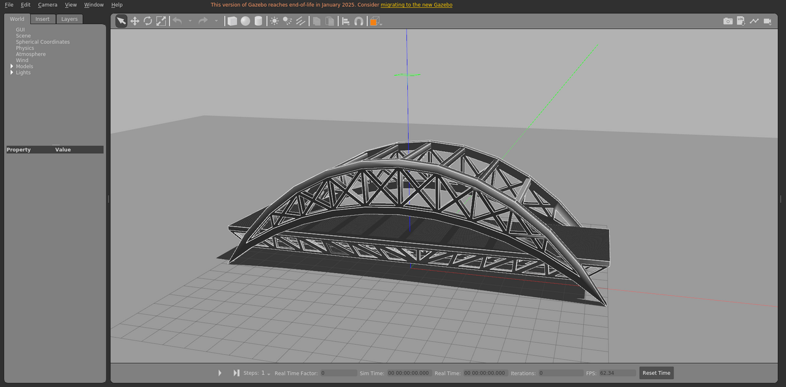 | `roslaunch gazebo_ros empty_world.launch world_name:="$(rospack find gazebo_sim_worlds)/worlds/bridge_static/bridge_static.world" gui:=true paused:=true` |
| `worlds/building_2f_static/building_2f_static.world` | 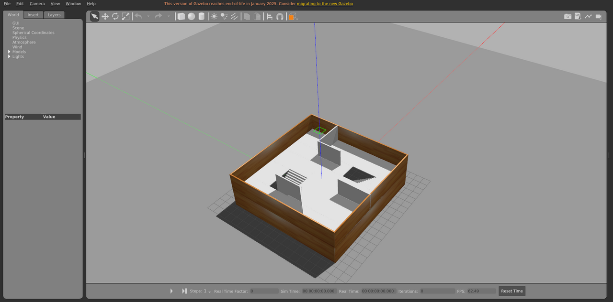 | `roslaunch gazebo_ros empty_world.launch world_name:="$(rospack find gazebo_sim_worlds)/worlds/building_2f_static/building_2f_static.world" gui:=true paused:=true` |
| `worlds/building_4f_static/building_4f_static.world` | 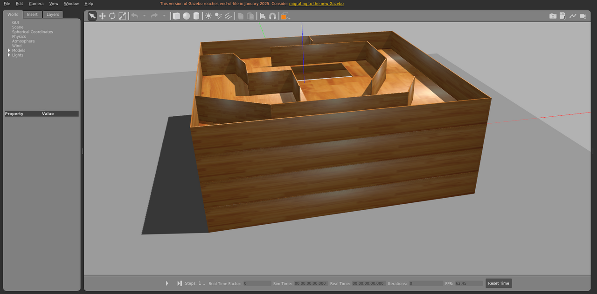 | `roslaunch gazebo_ros empty_world.launch world_name:="$(rospack find gazebo_sim_worlds)/worlds/building_4f_static/building_4f_static.world" gui:=true paused:=true` |
| `worlds/clearpath_playpen/clearpath_playpen.world` | 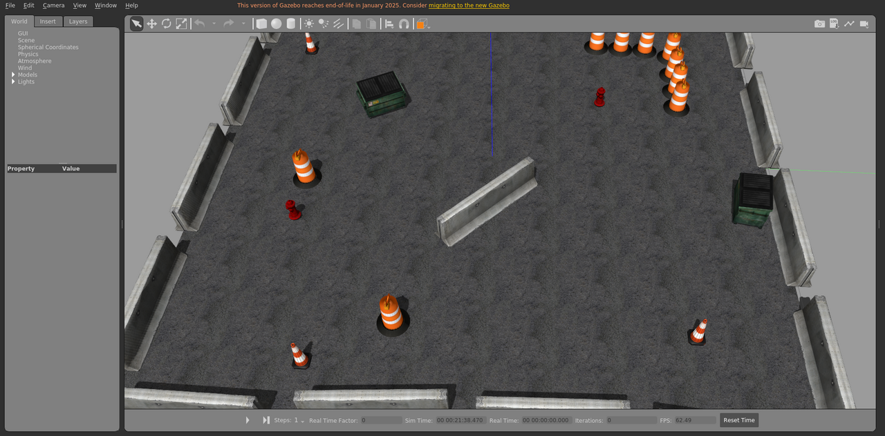 | `roslaunch gazebo_ros empty_world.launch world_name:="$(rospack find gazebo_sim_worlds)/worlds/clearpath_playpen/clearpath_playpen.world" gui:=true paused:=true` |
| `worlds/corridor_dynamic_9/corridor_dynamic_9.world` |  | `roslaunch gazebo_ros empty_world.launch world_name:="$(rospack find gazebo_sim_worlds)/worlds/corridor_dynamic_9/corridor_dynamic_9.world" gui:=true paused:=true` |
| `worlds/corridor_exp/corridor_exp.world` |  | `roslaunch gazebo_ros empty_world.launch world_name:="$(rospack find gazebo_sim_worlds)/worlds/corridor_exp/corridor_exp.world" gui:=true paused:=true` |
| `worlds/corridor_static/corridor_static.world` |  | `roslaunch gazebo_ros empty_world.launch world_name:="$(rospack find gazebo_sim_worlds)/worlds/corridor_static/corridor_static.world" gui:=true paused:=true` |
| `worlds/drone_arena/drone_arena.world` |  | `roslaunch gazebo_ros empty_world.launch world_name:="$(rospack find gazebo_sim_worlds)/worlds/drone_arena/drone_arena.world" gui:=true paused:=true` |
| `worlds/drone_arena_static/drone_arena_static.world` | 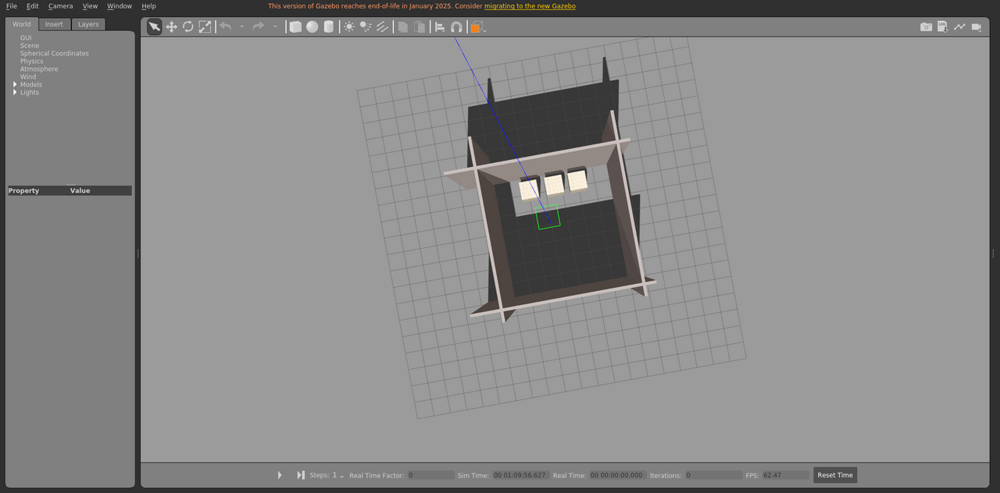 | `roslaunch gazebo_ros empty_world.launch world_name:="$(rospack find gazebo_sim_worlds)/worlds/drone_arena_static/drone_arena_static.world" gui:=true paused:=true` |
| `worlds/empty/empty.world` | 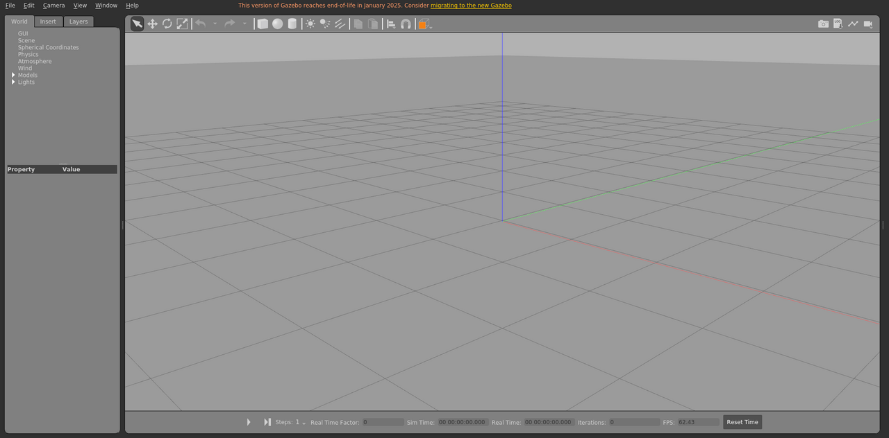 | `roslaunch gazebo_ros empty_world.launch world_name:="$(rospack find gazebo_sim_worlds)/worlds/empty/empty.world" gui:=true paused:=true` |
| `worlds/floor1_dynamic/floor1_dynamic.world` |  | `roslaunch gazebo_ros empty_world.launch world_name:="$(rospack find gazebo_sim_worlds)/worlds/floor1_dynamic/floor1_dynamic.world" gui:=true paused:=true` |
| `worlds/floor1_empty/floor1_empty.world` | 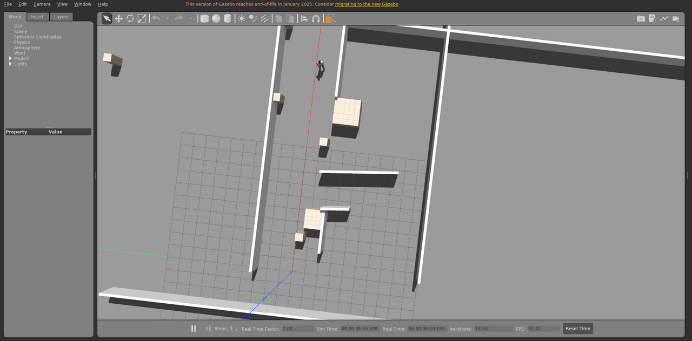 | `roslaunch gazebo_ros empty_world.launch world_name:="$(rospack find gazebo_sim_worlds)/worlds/floor1_empty/floor1_empty.world" gui:=true paused:=true` |
| `worlds/floor1_static_1/floor1_static_1.world` | 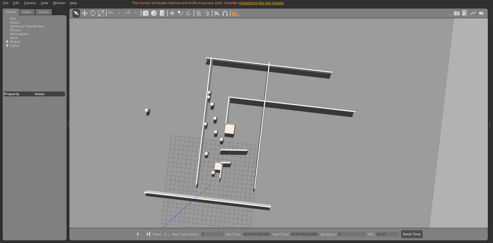 | `roslaunch gazebo_ros empty_world.launch world_name:="$(rospack find gazebo_sim_worlds)/worlds/floor1_static_1/floor1_static_1.world" gui:=true paused:=true` |
| `worlds/floor2_static_2/floor2_static_2.world` |  | `roslaunch gazebo_ros empty_world.launch world_name:="$(rospack find gazebo_sim_worlds)/worlds/floor2_static_2/floor2_static_2.world" gui:=true paused:=true` |
| `worlds/floorplan1_dynamic_16/floorplan1_dynamic_16.world` |  | `roslaunch gazebo_ros empty_world.launch world_name:="$(rospack find gazebo_sim_worlds)/worlds/floorplan1_dynamic_16/floorplan1_dynamic_16.world" gui:=true paused:=true` |
| `worlds/floorplan1_dynamic_6/floorplan1_dynamic_6.world` |  | `roslaunch gazebo_ros empty_world.launch world_name:="$(rospack find gazebo_sim_worlds)/worlds/floorplan1_dynamic_6/floorplan1_dynamic_6.world" gui:=true paused:=true` |
| `worlds/floorplan1_static/floorplan1_static.world` | 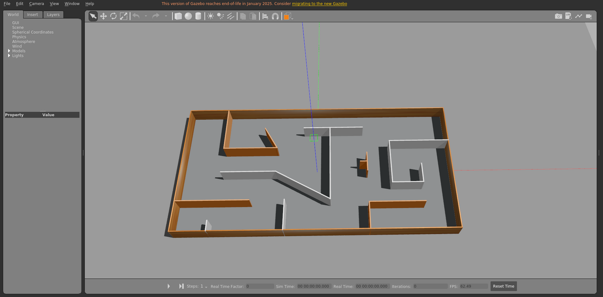 | `roslaunch gazebo_ros empty_world.launch world_name:="$(rospack find gazebo_sim_worlds)/worlds/floorplan1_static/floorplan1_static.world" gui:=true paused:=true` |
| `worlds/floorplan2_dynamic_12/floorplan2_dynamic_12.world` |  | `roslaunch gazebo_ros empty_world.launch world_name:="$(rospack find gazebo_sim_worlds)/worlds/floorplan2_dynamic_12/floorplan2_dynamic_12.world" gui:=true paused:=true` |
| `worlds/floorplan2_dynamic_5/floorplan2_dynamic_5.world` | 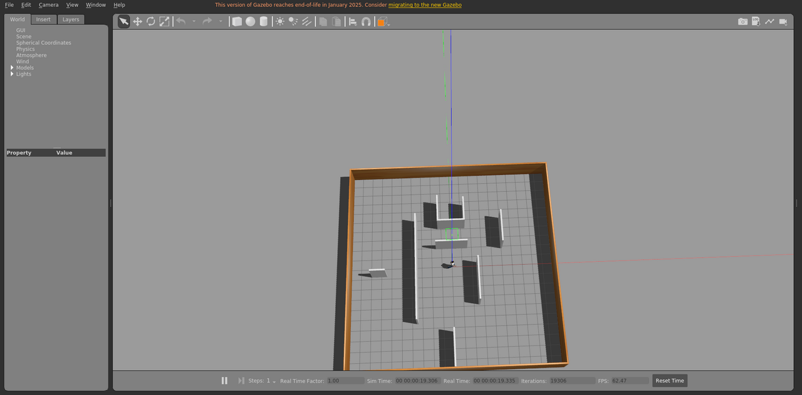 | `roslaunch gazebo_ros empty_world.launch world_name:="$(rospack find gazebo_sim_worlds)/worlds/floorplan2_dynamic_5/floorplan2_dynamic_5.world" gui:=true paused:=true` |
| `worlds/floorplan2_static/floorplan2_static.world` |  | `roslaunch gazebo_ros empty_world.launch world_name:="$(rospack find gazebo_sim_worlds)/worlds/floorplan2_static/floorplan2_static.world" gui:=true paused:=true` |
| `worlds/floorplan3_box_dynamic_4/floorplan3_box_dynamic_4.world` | 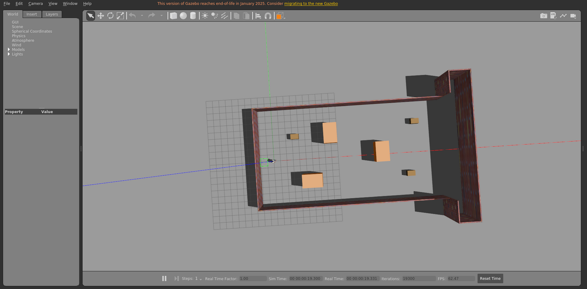 | `roslaunch gazebo_ros empty_world.launch world_name:="$(rospack find gazebo_sim_worlds)/worlds/floorplan3_box_dynamic_4/floorplan3_box_dynamic_4.world" gui:=true paused:=true` |
| `worlds/floorplan3_box_static/floorplan3_box_static.world` |  | `roslaunch gazebo_ros empty_world.launch world_name:="$(rospack find gazebo_sim_worlds)/worlds/floorplan3_box_static/floorplan3_box_static.world" gui:=true paused:=true` |
| `worlds/floorplan3_dynamic_8/floorplan3_dynamic_8.world` | 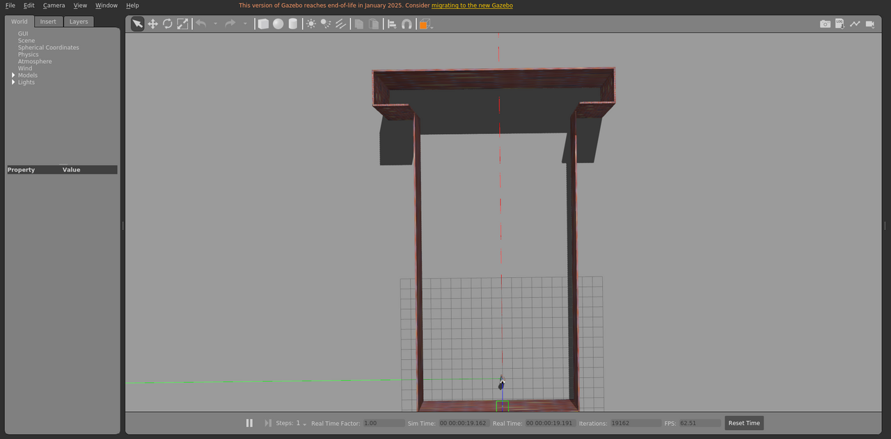 | `roslaunch gazebo_ros empty_world.launch world_name:="$(rospack find gazebo_sim_worlds)/worlds/floorplan3_dynamic_8/floorplan3_dynamic_8.world" gui:=true paused:=true` |
| `worlds/floorplan3_static/floorplan3_static.world` | 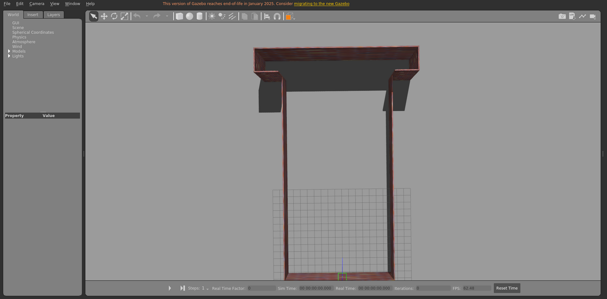 | `roslaunch gazebo_ros empty_world.launch world_name:="$(rospack find gazebo_sim_worlds)/worlds/floorplan3_static/floorplan3_static.world" gui:=true paused:=true` |
| `worlds/floorplan4_static/floorplan4_static.world` | 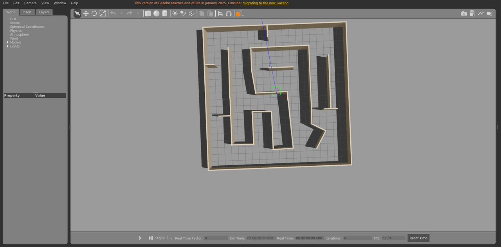 | `roslaunch gazebo_ros empty_world.launch world_name:="$(rospack find gazebo_sim_worlds)/worlds/floorplan4_static/floorplan4_static.world" gui:=true paused:=true` |
| `worlds/gen_env_generated_env/gen_env_generated_env.world` |  | `roslaunch gazebo_ros empty_world.launch world_name:="$(rospack find gazebo_sim_worlds)/worlds/gen_env_generated_env/gen_env_generated_env.world" gui:=true paused:=true` |
| `worlds/generated_env/generated_env.world` |  | `roslaunch gazebo_ros empty_world.launch world_name:="$(rospack find gazebo_sim_worlds)/worlds/generated_env/generated_env.world" gui:=true paused:=true` |
| `worlds/generated_env_mod/generated_env_mod.world` | 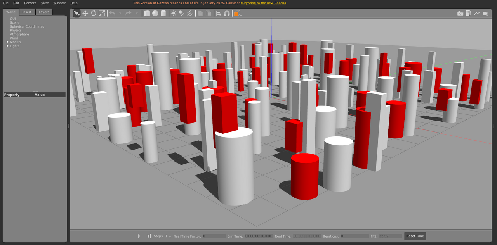 | `roslaunch gazebo_ros empty_world.launch world_name:="$(rospack find gazebo_sim_worlds)/worlds/generated_env_mod/generated_env_mod.world" gui:=true paused:=true` |
| `worlds/generated_env_mod_1/generated_env_mod_1.world` | 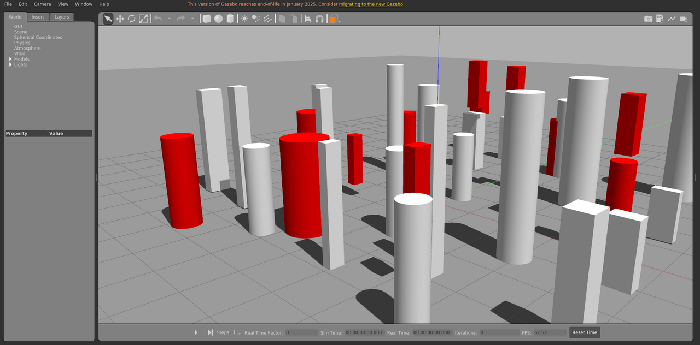 | `roslaunch gazebo_ros empty_world.launch world_name:="$(rospack find gazebo_sim_worlds)/worlds/generated_env_mod_1/generated_env_mod_1.world" gui:=true paused:=true` |
| `worlds/room_empty/room_empty.world` |  | `roslaunch gazebo_ros empty_world.launch world_name:="$(rospack find gazebo_sim_worlds)/worlds/room_empty/room_empty.world" gui:=true paused:=true` |
| `worlds/room_static/room_static.world` | 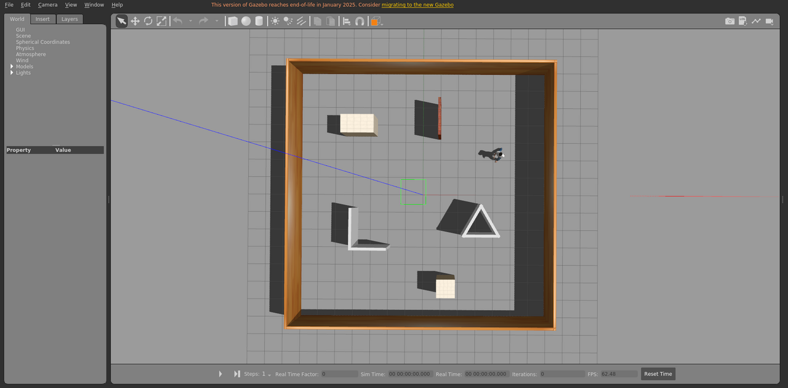 | `roslaunch gazebo_ros empty_world.launch world_name:="$(rospack find gazebo_sim_worlds)/worlds/room_static/room_static.world" gui:=true paused:=true` |
| `worlds/simple_box_dynamic_3/simple_box_dynamic_3.world` |  | `roslaunch gazebo_ros empty_world.launch world_name:="$(rospack find gazebo_sim_worlds)/worlds/simple_box_dynamic_3/simple_box_dynamic_3.world" gui:=true paused:=true` |
| `worlds/simple_box_static/simple_box_static.world` | 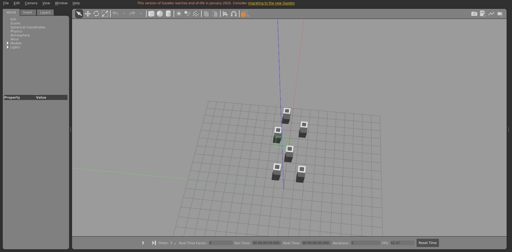 | `roslaunch gazebo_ros empty_world.launch world_name:="$(rospack find gazebo_sim_worlds)/worlds/simple_box_static/simple_box_static.world" gui:=true paused:=true` |
| `worlds/square_box/square_box.world` |  | `roslaunch gazebo_ros empty_world.launch world_name:="$(rospack find gazebo_sim_worlds)/worlds/square_box/square_box.world" gui:=true paused:=true` |
| `worlds/square_box_dynamic_14/square_box_dynamic_14.world` | 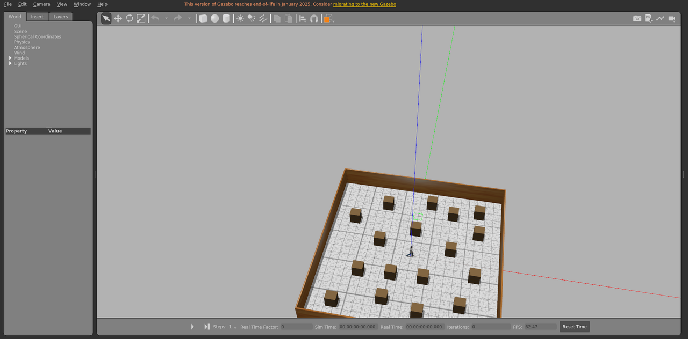 | `roslaunch gazebo_ros empty_world.launch world_name:="$(rospack find gazebo_sim_worlds)/worlds/square_box_dynamic_14/square_box_dynamic_14.world" gui:=true paused:=true` |
| `worlds/square_box_dynamic_8/square_box_dynamic_8.world` |  | `roslaunch gazebo_ros empty_world.launch world_name:="$(rospack find gazebo_sim_worlds)/worlds/square_box_dynamic_8/square_box_dynamic_8.world" gui:=true paused:=true` |
| `worlds/square_dynamic_7/square_dynamic_7.world` | 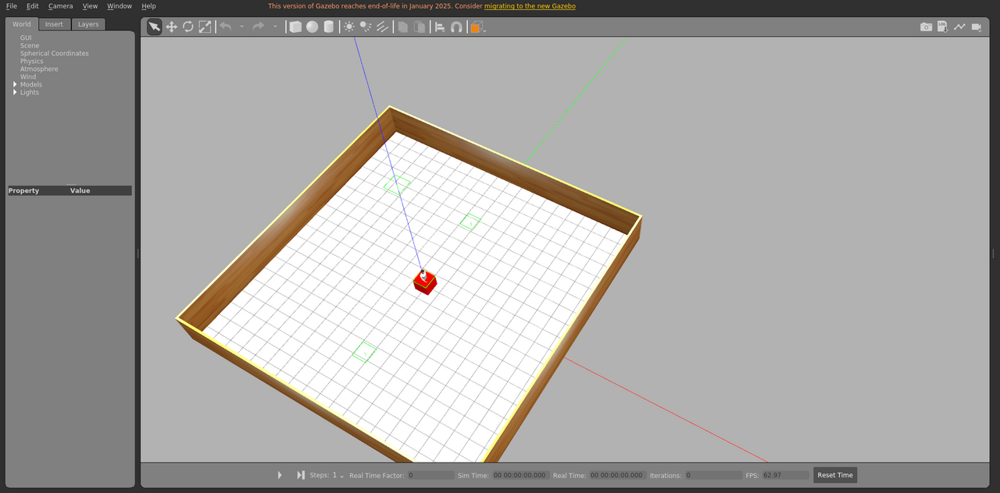 | `roslaunch gazebo_ros empty_world.launch world_name:="$(rospack find gazebo_sim_worlds)/worlds/square_dynamic_7/square_dynamic_7.world" gui:=true paused:=true` |
| `worlds/square_exp/square_exp.world` | 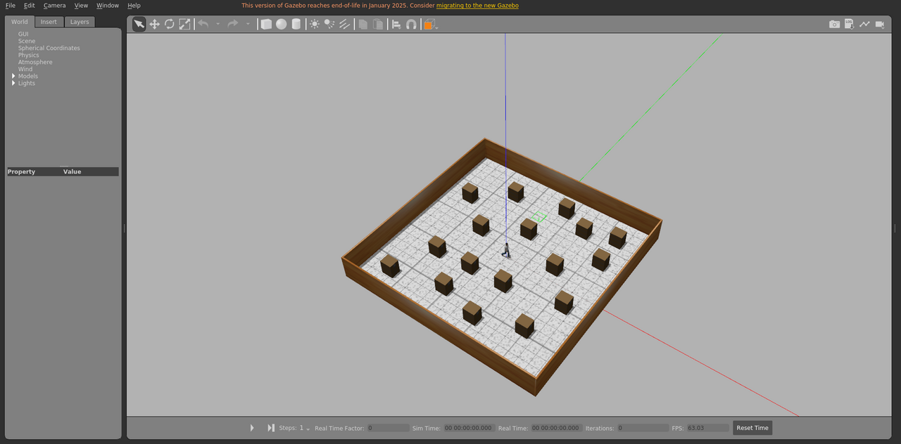 | `roslaunch gazebo_ros empty_world.launch world_name:="$(rospack find gazebo_sim_worlds)/worlds/square_exp/square_exp.world" gui:=true paused:=true` |
| `worlds/square_static/square_static.world` |  | `roslaunch gazebo_ros empty_world.launch world_name:="$(rospack find gazebo_sim_worlds)/worlds/square_static/square_static.world" gui:=true paused:=true` |
| `worlds/square_test/square_test.world` | 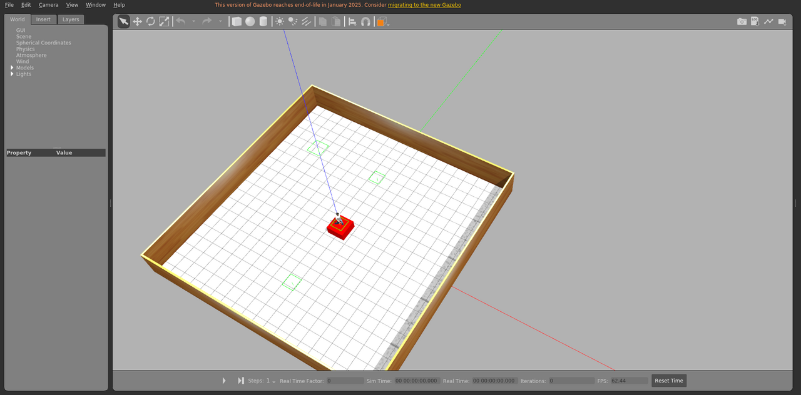 | `roslaunch gazebo_ros empty_world.launch world_name:="$(rospack find gazebo_sim_worlds)/worlds/square_test/square_test.world" gui:=true paused:=true` |
| `worlds/test/test.world` | 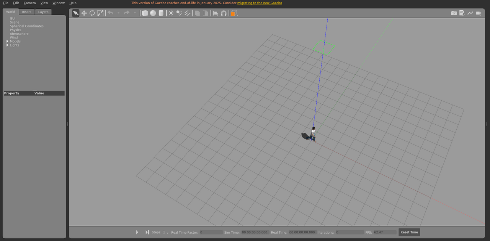 | `roslaunch gazebo_ros empty_world.launch world_name:="$(rospack find gazebo_sim_worlds)/worlds/test/test.world" gui:=true paused:=true` |
| `worlds/test2/test2.world` | 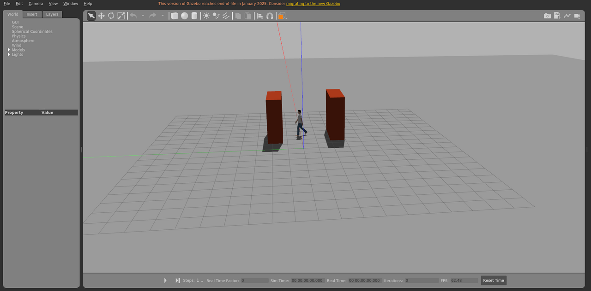 | `roslaunch gazebo_ros empty_world.launch world_name:="$(rospack find gazebo_sim_worlds)/worlds/test2/test2.world" gui:=true paused:=true` |
| `worlds/test_empty/test_empty.world` |  | `roslaunch gazebo_ros empty_world.launch world_name:="$(rospack find gazebo_sim_worlds)/worlds/test_empty/test_empty.world" gui:=true paused:=true` |
| `worlds/test_mill19_1/test_mill19_1.world` | 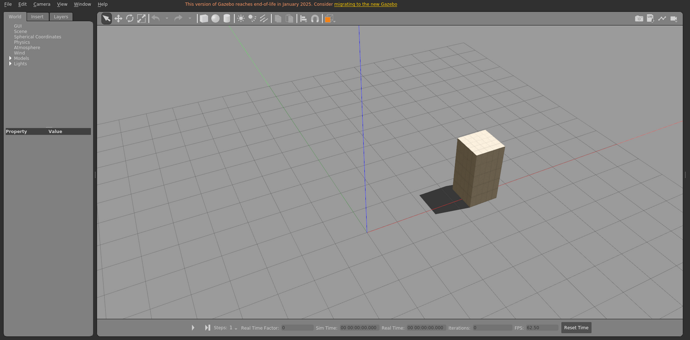 | `roslaunch gazebo_ros empty_world.launch world_name:="$(rospack find gazebo_sim_worlds)/worlds/test_mill19_1/test_mill19_1.world" gui:=true paused:=true` |
| `worlds/test_mill19_2/test_mill19_2.world` | 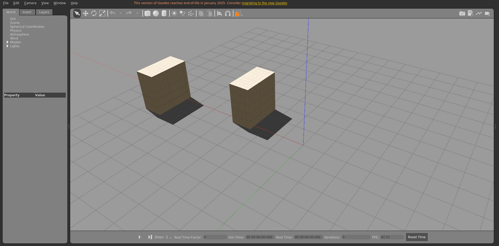 | `roslaunch gazebo_ros empty_world.launch world_name:="$(rospack find gazebo_sim_worlds)/worlds/test_mill19_2/test_mill19_2.world" gui:=true paused:=true` |
| `worlds/test_mill19_3/test_mill19_3.world` | 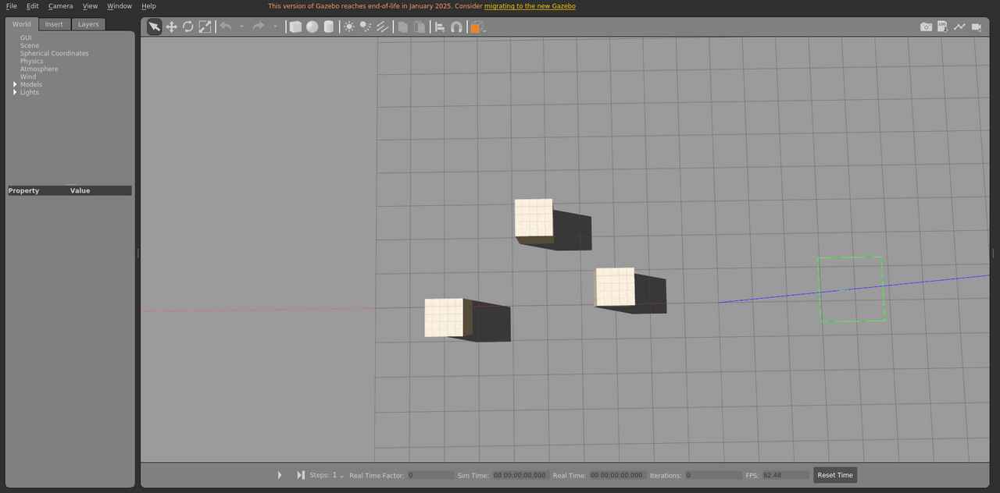 | `roslaunch gazebo_ros empty_world.launch world_name:="$(rospack find gazebo_sim_worlds)/worlds/test_mill19_3/test_mill19_3.world" gui:=true paused:=true` |
| `worlds/test_mill19_floor2/test_mill19_floor2.world` |  | `roslaunch gazebo_ros empty_world.launch world_name:="$(rospack find gazebo_sim_worlds)/worlds/test_mill19_floor2/test_mill19_floor2.world" gui:=true paused:=true` |
| `worlds/test_mill19_floor2_box/test_mill19_floor2_box.world` |  | `roslaunch gazebo_ros empty_world.launch world_name:="$(rospack find gazebo_sim_worlds)/worlds/test_mill19_floor2_box/test_mill19_floor2_box.world" gui:=true paused:=true` |
| `worlds/tunnel_basic_static/tunnel_basic_static.world` |  | `roslaunch gazebo_ros empty_world.launch world_name:="$(rospack find gazebo_sim_worlds)/worlds/tunnel_basic_static/tunnel_basic_static.world" gui:=true paused:=true` |
| `worlds/tunnel_c_shape_basic_static/tunnel_c_shape_basic_static.world` | 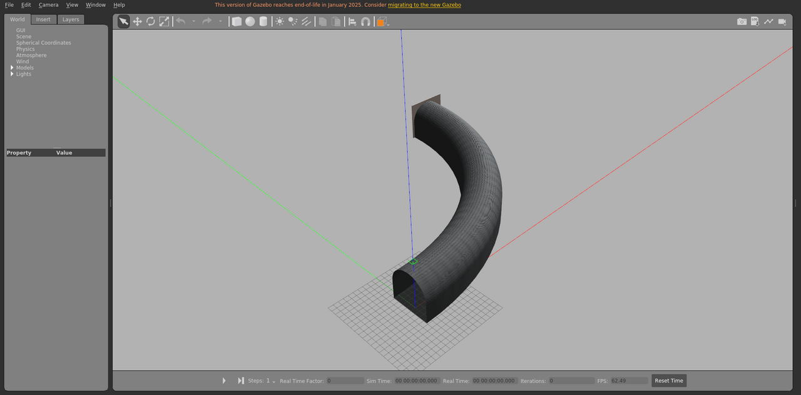 | `roslaunch gazebo_ros empty_world.launch world_name:="$(rospack find gazebo_sim_worlds)/worlds/tunnel_c_shape_basic_static/tunnel_c_shape_basic_static.world" gui:=true paused:=true` |
| `worlds/tunnel_dynamic_1/tunnel_dynamic_1.world` | 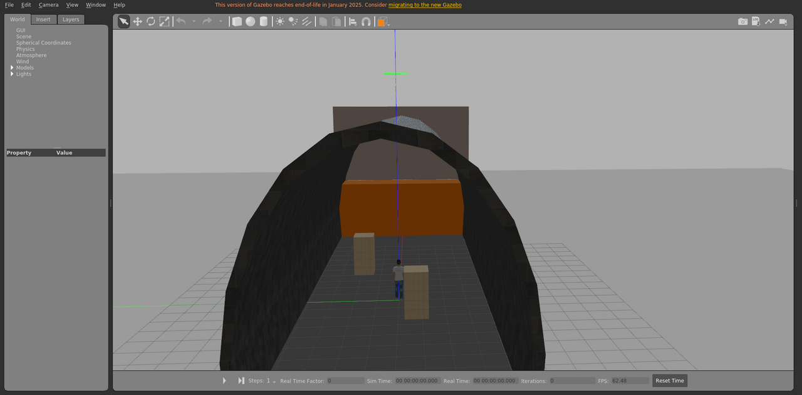 | `roslaunch gazebo_ros empty_world.launch world_name:="$(rospack find gazebo_sim_worlds)/worlds/tunnel_dynamic_1/tunnel_dynamic_1.world" gui:=true paused:=true` |
| `worlds/tunnel_fukushima_dynamic1/tunnel_fukushima_dynamic1.world` | 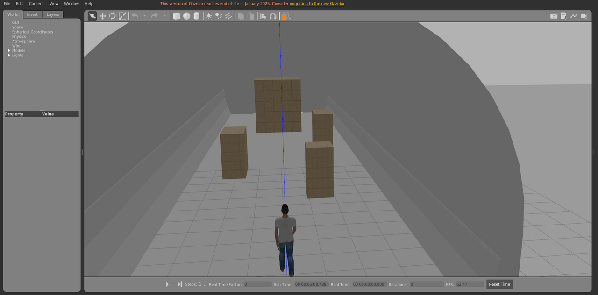 | `roslaunch gazebo_ros empty_world.launch world_name:="$(rospack find gazebo_sim_worlds)/worlds/tunnel_fukushima_dynamic1/tunnel_fukushima_dynamic1.world" gui:=true paused:=true` |
| `worlds/tunnel_fukushima_static/tunnel_fukushima_static.world` | 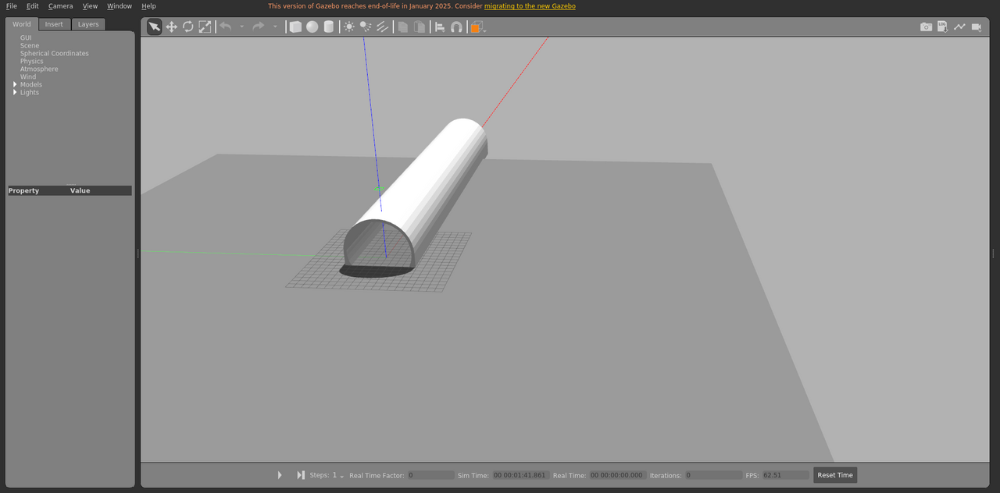 | `roslaunch gazebo_ros empty_world.launch world_name:="$(rospack find gazebo_sim_worlds)/worlds/tunnel_fukushima_static/tunnel_fukushima_static.world" gui:=true paused:=true` |
| `worlds/tunnel_fukushima_static_box/tunnel_fukushima_static_box.world` | 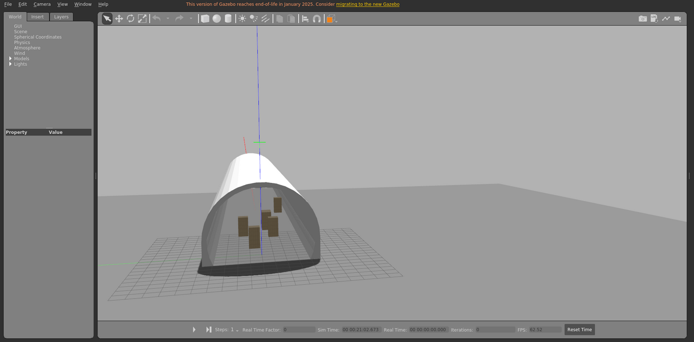 | `roslaunch gazebo_ros empty_world.launch world_name:="$(rospack find gazebo_sim_worlds)/worlds/tunnel_fukushima_static_box/tunnel_fukushima_static_box.world" gui:=true paused:=true` |
| `worlds/tunnel_s_shape_basic_static/tunnel_s_shape_basic_static.world` | 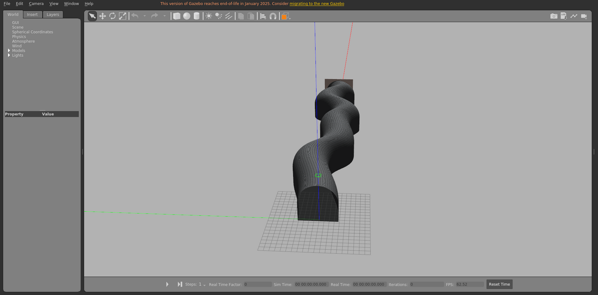 | `roslaunch gazebo_ros empty_world.launch world_name:="$(rospack find gazebo_sim_worlds)/worlds/tunnel_s_shape_basic_static/tunnel_s_shape_basic_static.world" gui:=true paused:=true` |
| `worlds/tunnel_static/tunnel_static.world` | 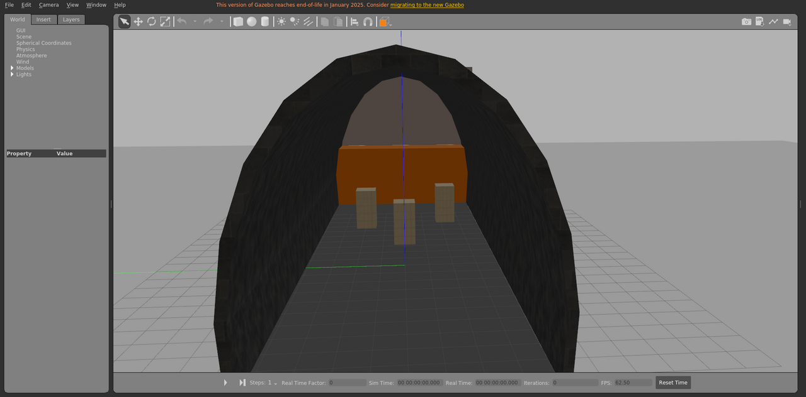 | `roslaunch gazebo_ros empty_world.launch world_name:="$(rospack find gazebo_sim_worlds)/worlds/tunnel_static/tunnel_static.world" gui:=true paused:=true` |
| `worlds/tunnel_static_long/tunnel_static_long.world` |  | `roslaunch gazebo_ros empty_world.launch world_name:="$(rospack find gazebo_sim_worlds)/worlds/tunnel_static_long/tunnel_static_long.world" gui:=true paused:=true` |
| `worlds/tunnel_straight_basic_static/tunnel_straight_basic_static.world` | 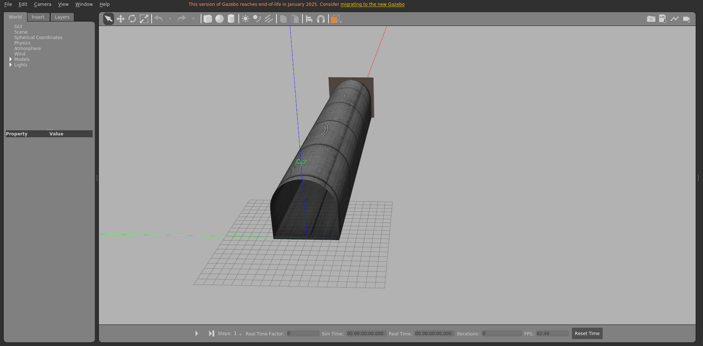 | `roslaunch gazebo_ros empty_world.launch world_name:="$(rospack find gazebo_sim_worlds)/worlds/tunnel_straight_basic_static/tunnel_straight_basic_static.world" gui:=true paused:=true` |
| `worlds/tunnel_straight_dynamic_5/tunnel_straight_dynamic_5.world` | 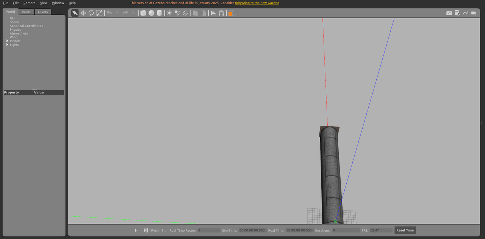 | `roslaunch gazebo_ros empty_world.launch world_name:="$(rospack find gazebo_sim_worlds)/worlds/tunnel_straight_dynamic_5/tunnel_straight_dynamic_5.world" gui:=true paused:=true` |
| `worlds/tunnel_straight_static/tunnel_straight_static.world` |  | `roslaunch gazebo_ros empty_world.launch world_name:="$(rospack find gazebo_sim_worlds)/worlds/tunnel_straight_static/tunnel_straight_static.world" gui:=true paused:=true` |
| `worlds/weston_robot_empty/weston_robot_empty.world` |  | `roslaunch gazebo_ros empty_world.launch world_name:="$(rospack find gazebo_sim_worlds)/worlds/weston_robot_empty/weston_robot_empty.world" gui:=true paused:=true` |

<!-- WORLD_CATALOG_END -->
