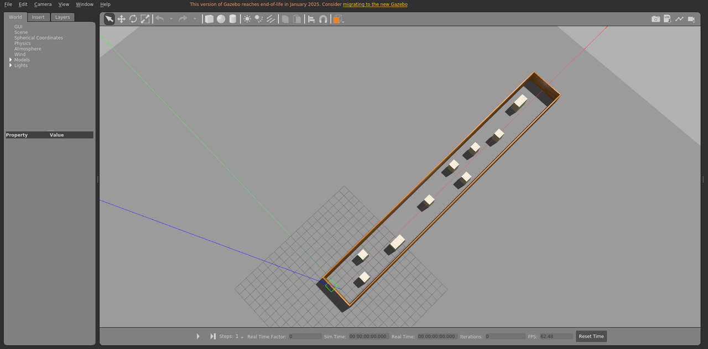

# corridor_static

走廊场景，静态布景。

World: [`corridor_static.world`](corridor_static.world)



## Launch

```bash
roslaunch gazebo_ros empty_world.launch world_name:="$(rospack find gazebo_sim_worlds)/worlds/corridor_static/corridor_static.world" gui:=true paused:=true
```
