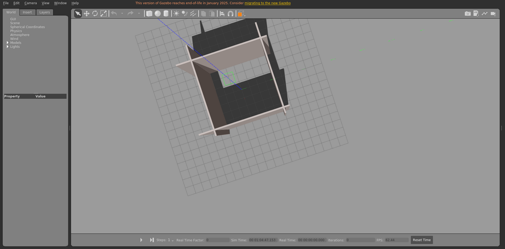

# drone_arena

无人机测试场地，用于 Gazebo 场景加载和仿真验证。

World: [`drone_arena.world`](drone_arena.world)



## Launch

```bash
roslaunch gazebo_ros empty_world.launch world_name:="$(rospack find gazebo_sim_worlds)/worlds/drone_arena/drone_arena.world" gui:=true paused:=true
```
