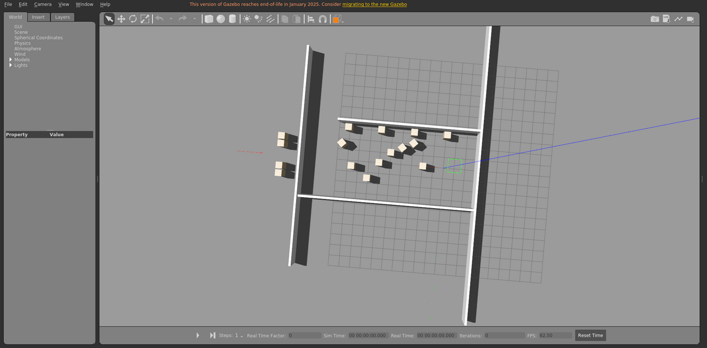

# floor2_static_2

室内楼层平面场景，静态布景。

World: [`floor2_static_2.world`](floor2_static_2.world)



## Launch

```bash
roslaunch gazebo_ros empty_world.launch world_name:="$(rospack find gazebo_sim_worlds)/worlds/floor2_static_2/floor2_static_2.world" gui:=true paused:=true
```
