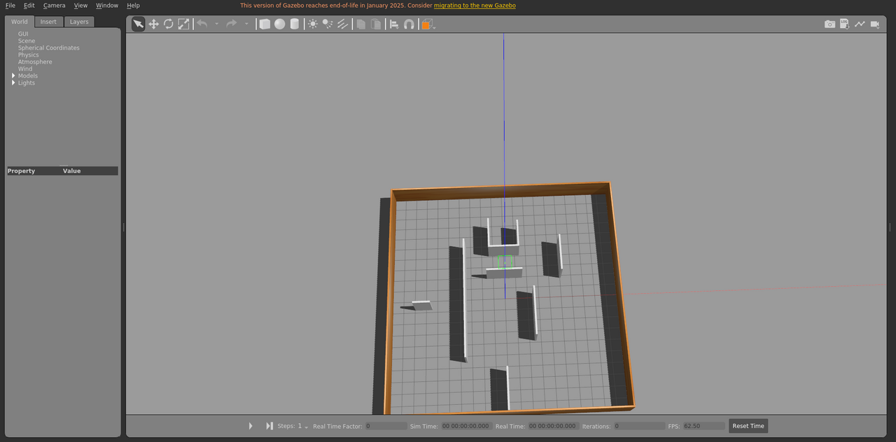

# floorplan2_static

室内楼层平面场景，静态布景。

World: [`floorplan2_static.world`](floorplan2_static.world)



## Launch

```bash
roslaunch gazebo_ros empty_world.launch world_name:="$(rospack find gazebo_sim_worlds)/worlds/floorplan2_static/floorplan2_static.world" gui:=true paused:=true
```
