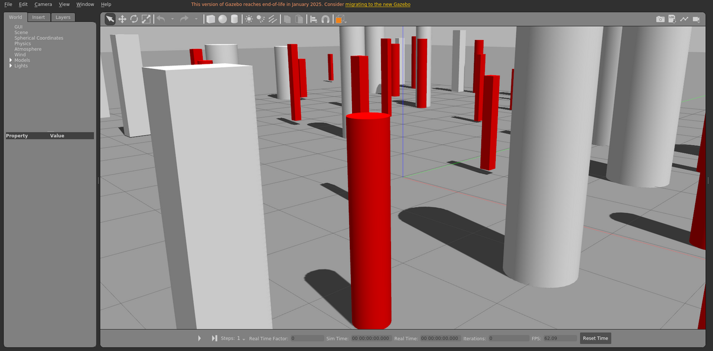

# generated_env

程序生成环境场景，包含动态障碍物，运动由场景导演包发布的 `libobstaclePathPlugin.so` 驱动。

World: [`generated_env.world`](generated_env.world)



## Launch

```bash
roslaunch gazebo_ros empty_world.launch world_name:="$(rospack find gazebo_sim_worlds)/worlds/generated_env/generated_env.world" gui:=true paused:=true
```
