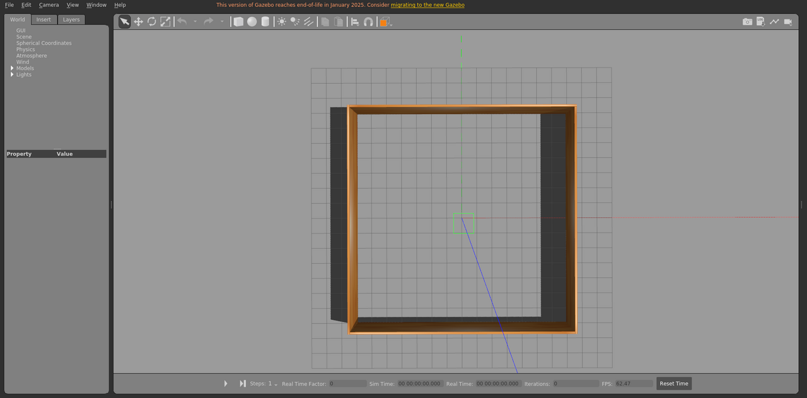

# room_empty

房间场景，用于基础加载和坐标/光照检查。

World: [`room_empty.world`](room_empty.world)



## Launch

```bash
roslaunch gazebo_ros empty_world.launch world_name:="$(rospack find gazebo_sim_worlds)/worlds/room_empty/room_empty.world" gui:=true paused:=true
```
