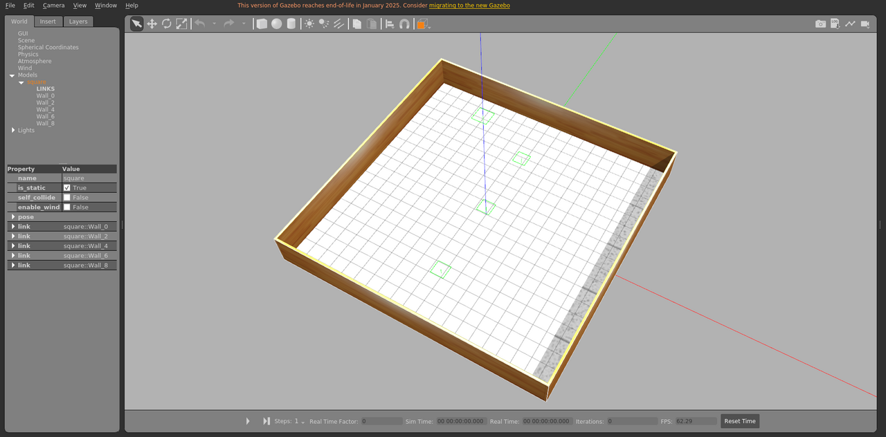

# square_static

方形障碍物场景，静态布景。

World: [`square_static.world`](square_static.world)



## Launch

```bash
roslaunch gazebo_ros empty_world.launch world_name:="$(rospack find gazebo_sim_worlds)/worlds/square_static/square_static.world" gui:=true paused:=true
```
