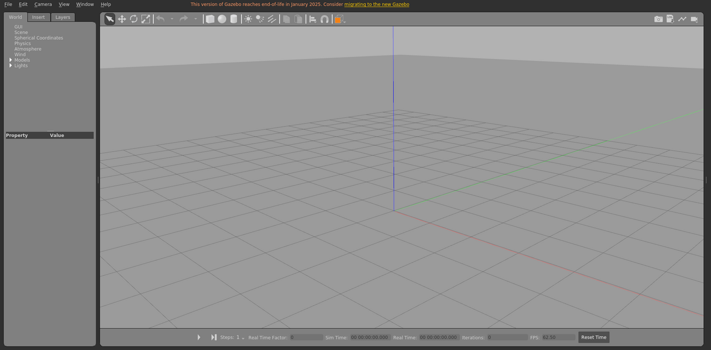

# test_empty

测试场景，用于基础加载和坐标/光照检查。

World: [`test_empty.world`](test_empty.world)



## Launch

```bash
roslaunch gazebo_ros empty_world.launch world_name:="$(rospack find gazebo_sim_worlds)/worlds/test_empty/test_empty.world" gui:=true paused:=true
```
