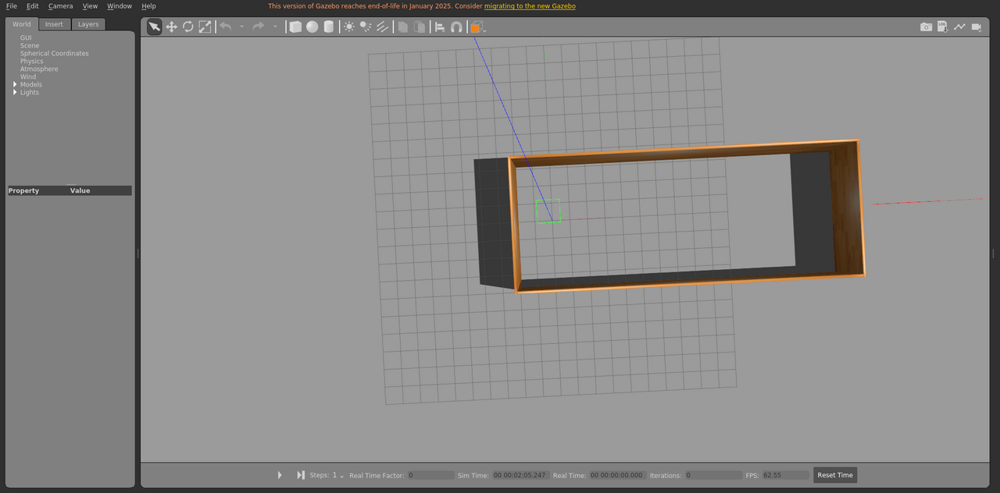

# test_mill19_floor2

Mill19 测试场景，用于 Gazebo 场景加载和仿真验证。

World: [`test_mill19_floor2.world`](test_mill19_floor2.world)



## Launch

```bash
roslaunch gazebo_ros empty_world.launch world_name:="$(rospack find gazebo_sim_worlds)/worlds/test_mill19_floor2/test_mill19_floor2.world" gui:=true paused:=true
```
