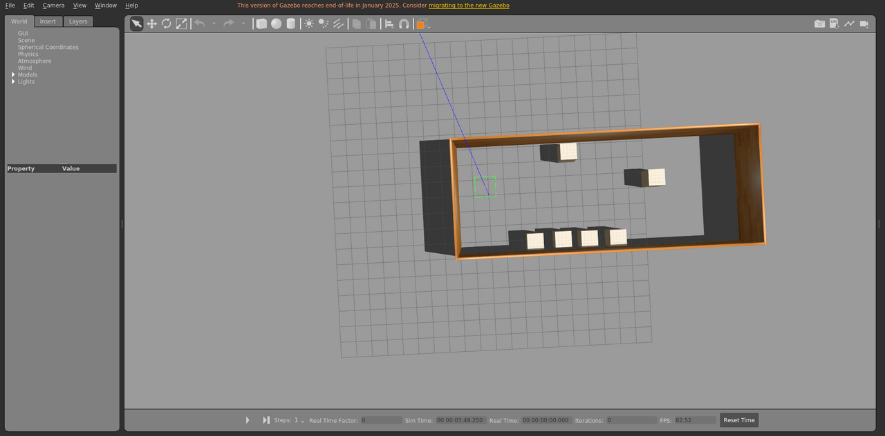

# test_mill19_floor2_box

箱体障碍物场景，包含箱体障碍物。

World: [`test_mill19_floor2_box.world`](test_mill19_floor2_box.world)



## Launch

```bash
roslaunch gazebo_ros empty_world.launch world_name:="$(rospack find gazebo_sim_worlds)/worlds/test_mill19_floor2_box/test_mill19_floor2_box.world" gui:=true paused:=true
```
