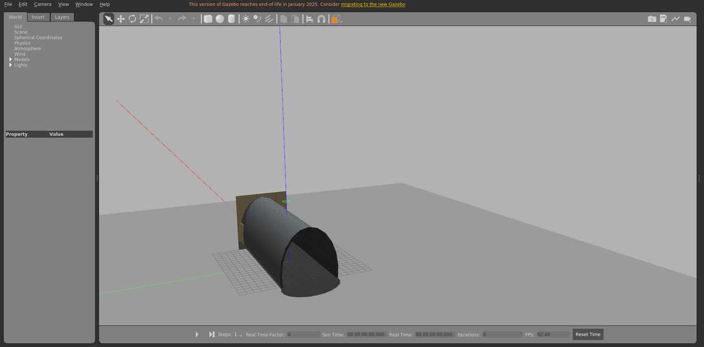

# tunnel_basic_static

隧道场景，静态布景。

World: [`tunnel_basic_static.world`](tunnel_basic_static.world)



## Launch

```bash
roslaunch gazebo_ros empty_world.launch world_name:="$(rospack find gazebo_sim_worlds)/worlds/tunnel_basic_static/tunnel_basic_static.world" gui:=true paused:=true
```
