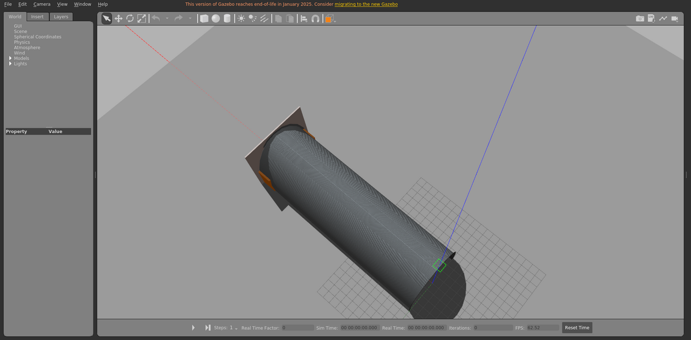

# tunnel_static_long

隧道场景，静态布景。

World: [`tunnel_static_long.world`](tunnel_static_long.world)



## Launch

```bash
roslaunch gazebo_ros empty_world.launch world_name:="$(rospack find gazebo_sim_worlds)/worlds/tunnel_static_long/tunnel_static_long.world" gui:=true paused:=true
```
