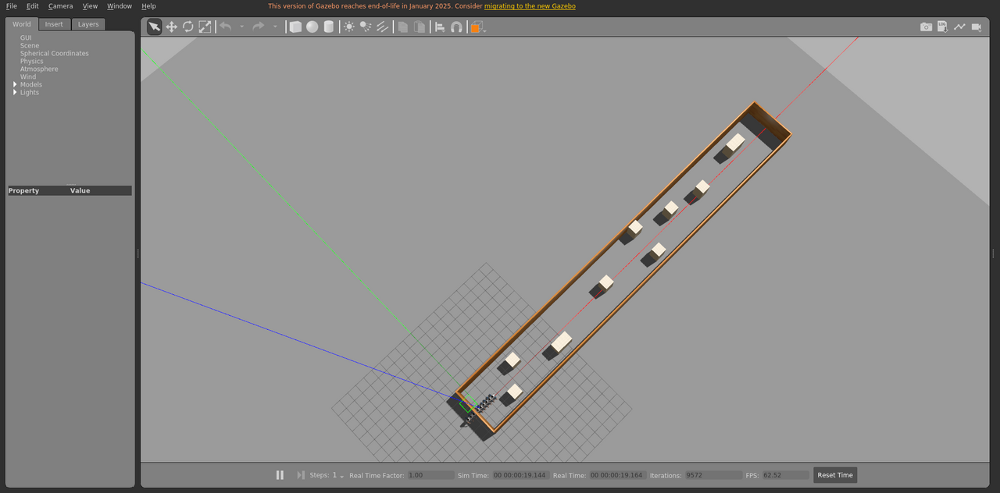

# corridor_dynamic_9

走廊场景，包含动态障碍物，运动由本包发布的 `libobstaclePathPlugin.so` 驱动。

World: [`corridor_dynamic_9.world`](corridor_dynamic_9.world)



## Launch

```bash
roslaunch gazebo_ros empty_world.launch world_name:="$(rospack find gazebo_sim_worlds)/worlds/corridor_dynamic_9/corridor_dynamic_9.world" gui:=true paused:=true
```
