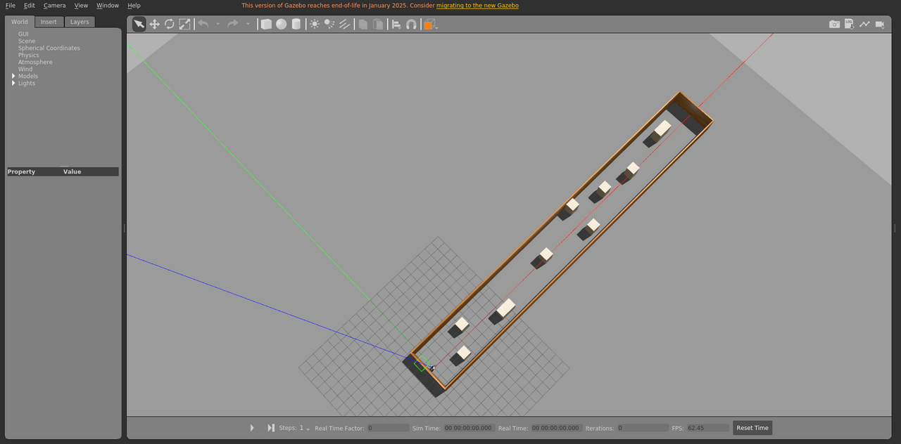

# corridor_exp

走廊场景，包含动态障碍物，运动由本包发布的 `libobstaclePathPlugin.so` 驱动。

World: [`corridor_exp.world`](corridor_exp.world)



## Launch

```bash
roslaunch gazebo_ros empty_world.launch world_name:="$(rospack find gazebo_sim_worlds)/worlds/corridor_exp/corridor_exp.world" gui:=true paused:=true
```
