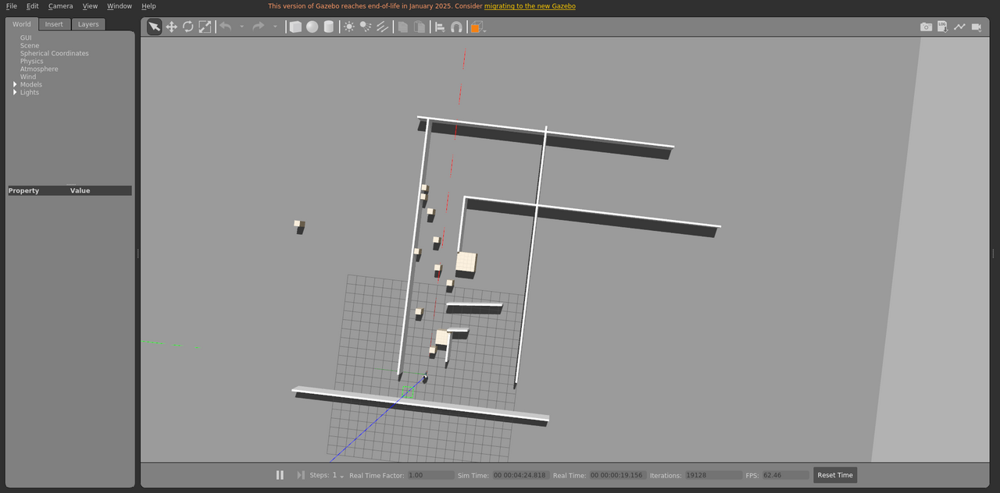

# floor1_dynamic

室内楼层平面场景，包含动态障碍物，运动由本包发布的 `libobstaclePathPlugin.so` 驱动。

World: [`floor1_dynamic.world`](floor1_dynamic.world)



## Launch

```bash
roslaunch gazebo_ros empty_world.launch world_name:="$(rospack find gazebo_sim_worlds)/worlds/floor1_dynamic/floor1_dynamic.world" gui:=true paused:=true
```
