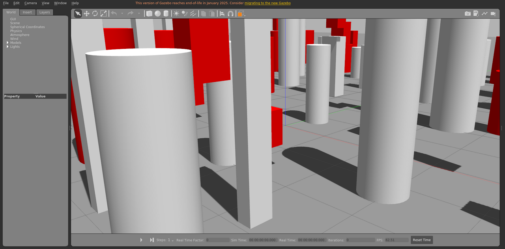

# gen_env_generated_env

程序生成环境场景，包含动态障碍物，运动由本包发布的 `libobstaclePathPlugin.so` 驱动。

World: [`gen_env_generated_env.world`](gen_env_generated_env.world)



## Launch

```bash
roslaunch gazebo_ros empty_world.launch world_name:="$(rospack find gazebo_sim_worlds)/worlds/gen_env_generated_env/gen_env_generated_env.world" gui:=true paused:=true
```
