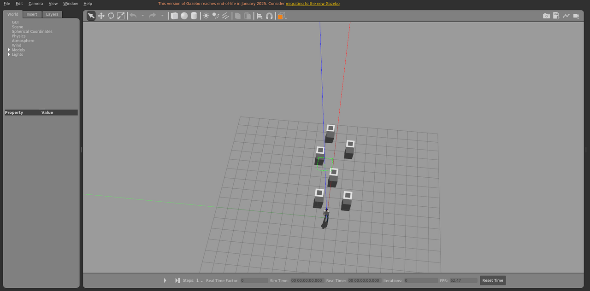

# simple_box_dynamic_3

箱体障碍物场景，包含动态障碍物，运动由本包发布的 `libobstaclePathPlugin.so` 驱动。

World: [`simple_box_dynamic_3.world`](simple_box_dynamic_3.world)



## Launch

```bash
roslaunch gazebo_ros empty_world.launch world_name:="$(rospack find gazebo_sim_worlds)/worlds/simple_box_dynamic_3/simple_box_dynamic_3.world" gui:=true paused:=true
```
